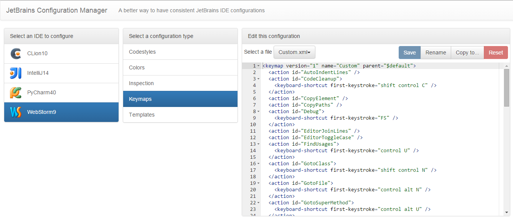

# JetBrains Configuration Manager
I don't know about you, but I like my editors *consistent*.

I also really like JetBrains IDEs. I work on multiple machines (laptops, desktops, work, home), and I would really
like the ability to have a global configuration for each editor I use. I use GitHub for my dotfiles, but that isn't enough.

JetBrains editors don't really talk to each other to save settings, so I made my own way of doing it in a nice, managed
interface.

## Screenshot

## Install
Simply `git clone` this repository, then:

   npm install
   node server.js

## Usage
The interface is quite simple and is very self-explanatory. Just play around with it!

**Note** that all changes you make are **PERMANENT** unless you have a dotfiles-like setup where you can revert your
changes.
